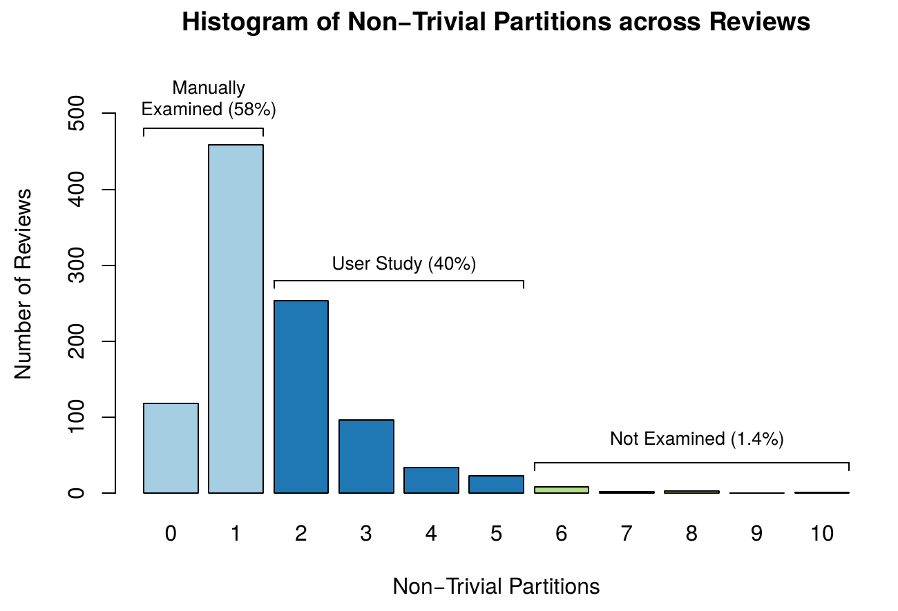
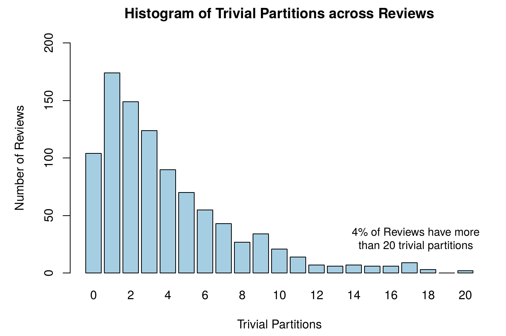

\newpage

# Introduction

Considering the promising results of the recently devised ClusterChanges (CC) technique published by Barnett et al. [[@barnett_helping_2015]] which automatically partitions changesets containing independent modifications to facilitate code review, we would like to better understand how widely applicable the technique is. To this end, we intend to analyze how ClusterChanges performs in a different context, namely open source software projects written by different organizations. 

In this initial study, we aimed to replicate the original quantitative study as closely as possible while using an open source software context. Therefore, we applied the ClusterChanges technique to a sample of 1000 pull requests from the most popular Java OSS projects hosted at GitHub. 

We chose to use pull requests because we believe they closely mirror the changesets used in the original CC study. That is, both are sets of pairs of changed files (before-file and after-file) that are submitted to be reviewed by other developers. As for using the most popular OSS projects, we hypothesized that they would have large numbers of pull requests to analyze. We chose GitHub because, at the time of writing, it is the largest code hoster in the world with about 21.3M repositories and a large amount of those are OSS projects. Regarding Java, aside from being a popular language for OSS projects, it allows us to verify if ClusterChanges is applicable to other programming languages.

We have implemented the ClusterChanges technique for Java projects and refer to this implementation as *ccjava* in this document. As the Roslyn compiler only works with C# code, we used the Eclipse Compiler for Java (ECJ) for parsing Java code in order to identify def-use, use-use and same enclosing methods relationships between diff-regions. We chose ECJ because it's a mature, open and incremental compiler whose main goal is analyzing partial programs that may not be fully compilable. The Eclipse IDE uses ECJ for performing real-time static analysis while the developers are editing the source code.


# Goals

* Analyze the effectiveness of ClusterChanges in the context of open source projects;
* Compare these results with the original study results [[@barnett_helping_2015]], which were obtained in a different context.

# Data collection

In this section, we describe how we obtained the data used in this analysis. The dataset used is available at: <https://github.com/victorclf/ccjava-analysis>

## Software project sample selection

We chose 10 software projects from GitHub in the following way:

1. In the GitHub web page, we asked for the list of open source Java projects in descending order of **stars** (search string: *stars:>1 language:java*). We hypothesized that the projects with the most stars are the most popular and would have the most pull requests.
2. Then we manually analyzed each software project in the list (until we had 10 projects) and selected it for the study if:
  + It used GitHub's pull request system;
  + It was not a mirror of a repository maintained somewhere else. When this is case, the GitHub's pull request system  is not being used by the project;
  + It had at least 300 pull requests which contained Java source code;
  + It was targeted at the JVM (i.e. Android exclusive projects were not considered);

## Pull request

A pull request consists of the created/modified files (after-files) and their corresponding diff files.

## Pull request sampling

For each software project:

1. Sampled 300 pull requests at random that matched the following criteria:
  + Had at least one Java source code after-file
2. Ran ccjava on these 300 pull requests;
3. Of these 300 pull requests, sampled 100 pull requests at random that matched the following criteria:
  + Was analyzed by ccjava without errors or warnings (see Limitations section at the end)
  

# Dataset description
  
The dataset is composed of the files below which were obtained after running ccjava on 1000 pull requests:

* allDefs.csv (Project name, Pull request ID, Definition ID, Source file, Character span, Name, Is type definition?, Is method definition?, Is inside a diff-region?)
* allUses.csv (Project name, Pull request ID, Use ID, Source file, Character span, Name, Associated definition)
* allDiffs.csv (Project name, Pull request ID, Diff-region ID, Source file, Line span, Character span)
* allDiffRelations.csv (Project name, Pull request ID, Relation ID, Relation type, Diff-region 1, Diff-region 2)
* allPartitions.csv (Project name, Pull request ID, Partition ID, Is partition trivial?, A diff region that is part of the partition, Method enclosing the diff-region)
* allSummary.csv (Project name, Pull request ID, Number of source files, Number of definitions, Number of uses, Number of diff-regions, Number of partitions, Number of non-trivial partitions, Number of trivial partitions)

\newpage

# Analysis

```{r, echo=FALSE, message=FALSE}
library(dplyr)
library(ggplot2)
library(grid)
library(scales)
library(pander)
summ <- read.csv("data/allSummary.csv.gz")
partitions <- read.csv("data/allPartitions.csv.gz")
pullRequests <- select(summ, projectName, pullRequestId)

# Adds methodsChanged column to summ
enclosingMethods <- partitions %>%
  select(projectName, pullRequestId, enclosingMethodDefId) %>%
  distinct() %>%
  filter(enclosingMethodDefId != "null")
methodsChanged <- pullRequests %>%
  left_join(enclosingMethods, by=c("projectName", "pullRequestId")) %>%
  group_by(projectName, pullRequestId) %>%
  summarise(methodsChanged = sum(!is.na(enclosingMethodDefId)))
summ <- summ %>%
  inner_join(methodsChanged, by=c("projectName", "pullRequestId"))

# Adds diffsInNonTrivialPartitions and RDN column to summ
diffsInNonTrivialPartitions <- pullRequests %>%
  left_join(filter(partitions, isTrivial == "false"), by=c("projectName", "pullRequestId")) %>%
  group_by(projectName, pullRequestId) %>%
  summarise(diffsInNonTrivialPartitions = sum(!is.na(isTrivial)))
summ <- summ %>%
  inner_join(diffsInNonTrivialPartitions, by=c("projectName", "pullRequestId")) %>%
  mutate(rdn = diffsInNonTrivialPartitions / diffs)

trivialPartitions <- select(summ, trivialPartitions)

nonTrivialPartitions <- select(summ, nonTrivialPartitions)
```

## Pull Requests

```{r, echo=FALSE, warning=FALSE}
filesChanged <- select(summ, projectName, pullRequestId, filesChanged = sourceFiles)
#methodsChanged <- select(summ, projectName, pullRequestId, methodsChanged)
diffRegions <- select(summ, projectName, pullRequestId, diffRegions = diffs)
```

A pull request is a set of changes that a developer would like to see merged into the main source repository, i.e. pulled from this developer's fork and merged into the source repository. To better understand pull requests, it's interesting to know the two most popular collaboration models for OSS projects [[@github_pull_request]]:

* *Fork & Pull*: core developers working on the project and outside contributors fork the project, make changes in their local repositories and issue pull requests. A group of maintainers have push access to the source repository and review the pull requests to decide what will be merged.
* *Shared Repository Model*: the core developers have push access to the main repository. Pull requests are mainly used by outside developers who want to contribute code.

In this section, we analyze our dataset of pull requests using the three metrics below, which were calculated for each pull request: 

* files changed (number of files which were modified)
* methods changed (methods which are inside a diff-region for each pull request)
* diff-regions (contiguous sequence of lines that were added or modified; deleted lines are not considered)

### Files Changed

```{r, echo=FALSE, warning=FALSE, fig.cap="Histogram showing the distribution of files changed in a pull request.\\label{fig:filesChanged}"}
ggplot(filesChanged, aes(x=filesChanged)) + geom_histogram(breaks=seq(0, 20, by=1), col="black", fill="lightblue") +
  coord_cartesian(xlim=c(-1, 20.5)) +
  scale_x_discrete(breaks=seq(0, 20, by=1)) +
  ggtitle("Histogram of Files Changed") +
  xlab("Files Changed") +
  ylab("Pull Requests")
```

```{r, echo=FALSE, warning=FALSE, comment="", fig.cap="Empirical cumulative distribution function of files changed in a pull request.\\label{fig:ecdfFilesChanged}"}
filesChangedQuantiles <- quantile(x=filesChanged$filesChanged, probs=seq(0, 1, 0.05))
filesChangedECDF <- ecdf(filesChanged$filesChanged)

ggplot(filesChanged, aes(x=filesChanged)) +
  stat_ecdf() +
  coord_cartesian(xlim=c(-1, 50)) +
  scale_x_discrete(breaks=seq(0, 50, by=2)) +
  ggtitle("ECDF of Files Changed") +
  xlab("Files Changed") +
  ylab("F(x)")
```

The histogram of Java source code files that were edited in each pull request (Figure \ref{fig:filesChanged}) indicate that changes in pull requests tend to be focused on a very small amount of files. In this sample, `r percent(filesChangedECDF(2))` of the pull requests affected at most 2 files and `r percent(filesChangedECDF(4))` of the pull requests affected at most 4 files.

This result suggests that pull requests are small and consequently easy to understand. However, other studies [[@rigby_convergent_2013]], [[@bacchelli_expectations_2013]] including the original CC study found that, even if few files are changed, it is still hard to understand the changes if there are several diff-regions.

Although the 95% quantile is `r filesChangedQuantiles["95%"]`, the largest pull request modified `r filesChangedQuantiles["100%"]` files. Considering this, we manually analyzed the first 5 pull requests with most files changed (shown below) to see if anything interesting could be observed and if these pull requests are actually valid.

```{r, echo=FALSE, comment=""}
filesChangedDescOrder <- summ %>%
  select(pName = projectName, prId = pullRequestId, filesChanged = sourceFiles, diffs, NTPs = nonTrivialPartitions, TPs = trivialPartitions) %>%
  arrange(desc(filesChanged))
head(filesChangedDescOrder, n=5)

summElastic5708 <- filter(summ, projectName == "elastic/elasticsearch", pullRequestId == 5708)
```

The [1st pull request](https://github.com/elastic/elasticsearch/pull/5708) was accepted by the developers and is therefore a valid occurrence. However, we noted something quite interesting in the discussion about it. The project developer reviewing the code expresses disappointment over the fact that the pull request actually consists of two separate tasks but has only one commit. After a brief discussion between the pull request author and this project developer, the latter agrees to merge the pull request as it is. Our implementation of ClusterChanges indeed generated 2 non-trivial partitions for this pull request and would likely have helped the project developer review this code. Of the `r select(summElastic5708, diffs)` diff-regions present in this pull request, `r select(summElastic5708, diffsInNonTrivialPartitions)` (`r select(summElastic5708, rdn)`) were grouped in these 2 non-trivial partitions.

The [2nd pull request](https://github.com/netty/netty/pull/370) was accepted by the developers but merged manually and consists of code style (formatting) modifications. Most of the diff-regions are additions of a copyright header and ClusterChanges does not identify such relationships. This explains why so many source files were changed and why non-trivial partitions were not found.

The [3rd pull request](https://github.com/netty/netty/pull/4) was rejected by the developers and there is not any discussion as to why that happened. After investigating the pull request message and the files changed, it seems reasonable to assume that this pull request was created incorrectly. The pull request message indicates that only the Javadoc of some methods were fixed, but 7,825 lines were added and most of the source code files were created. The presence of such invalid pull requests negatively impacts our assessment of the efficacy of ClusterChanges.

The [4th pull request](https://github.com/spring-projects/spring-framework/pull/554) was accepted by the developers and is valid. The author of the pull request created a compiler for a domain-specific language of the Spring Framework, thus a large number of files were created and modified. Apparently, this is a single task but 6 non-trivial partitions were identified nonetheless.

The [5th pull request](https://github.com/dropwizard/dropwizard/pull/996) is also valid and was accepted by the developers. The author replaced a widely used class in the project by another and as result there are a lot of diff-regions that are updates from references to the old class to references to the new class. For that reason, a lots of files were modified. Also, we believe it makes sense that only one non-trivial partition was detected here.

### Methods Changed\label{subsec:methodsChanged}

```{r, echo=FALSE, warning=FALSE, fig.cap="Histogram showing the distribution of methods changed in a pull request.\\label{fig:methodsChanged}", fig.pos='H'}
ggplot(methodsChanged, aes(x=methodsChanged)) +
  geom_histogram(breaks=seq(0, 50, by=1), col="black", fill="lightblue") +
  coord_cartesian(xlim=c(-1, 50.5)) +
  scale_x_discrete(breaks=seq(0, 50, by=2)) +
  ggtitle("Histogram of Methods Changed") +
  xlab("Methods Changed") +
  ylab("Pull Requests")
```

```{r, echo=FALSE, warning=FALSE, comment="", fig.cap="Empirical cumulative distribution function of methods changed in a pull request.\\label{fig:ecdfMethodsChanged}"}
methodsChangedQuantiles <- quantile(x=methodsChanged$methodsChanged, probs=seq(0, 1, 0.05))
methodsChangedECDF <- ecdf(methodsChanged$methodsChanged)

ggplot(methodsChanged, aes(x=methodsChanged)) +
  stat_ecdf()  +
  coord_cartesian(xlim=c(-1, 100.5)) +
  scale_x_discrete(breaks=seq(0, 100, by=5)) +
  ggtitle("ECDF of Methods Changed") +
  xlab("Methods Changed") +
  ylab("F(x)")
```

The graph (Figure \ref{fig:methodsChanged}) shows that the number of methods changed in a pull request tend to be small, but that it varies significantly and therefore pull requests that affect several methods are not unusual as evidenced by the very long positive tail. As much as `r percent(methodsChangedECDF(1))` of the pull requests only changed 1 method and the median of methods changed is `r methodsChangedQuantiles["50%"]`. In contrast, the second half of the distribution grows very quickly according to the quantiles. More specifically, we can see that 25% of the pull requests changed at least `r methodsChangedQuantiles["75%"]` methods and that 10% of the pull requests changed at least `r methodsChangedQuantiles["90%"]` methods.

We analyzed the 5 pull requests with the most methods changed to see what caused so many methods to be modified. These pull requests are listed below:

```{r, echo=FALSE, comment=""}
methodsChangedDescOrder <- summ %>%
  select(pName = projectName, prId = pullRequestId, methodsChanged, diffs, NTPs = nonTrivialPartitions, TPs = trivialPartitions) %>%
  arrange(desc(methodsChanged))
head(methodsChangedDescOrder, n=5)
```

The [pull request](https://github.com/netty/netty/pull/664) with 529 methods changed was valid and merged into the master branch. Most of the diff-regions consisted of changing the return value of several methods in a class hierarchy in order to support method chaining. Since the modified classes are meant to be used by users of the framework, there were few references to this modified methods and as a result there are a lot of partitions. Some of the modified methods were grouped into non-trivial partitions because test case methods referenced them (a def-use relationship).

The 2nd and 4th pull requests were previously described in the *Files Changed* section.

The [3rd pull request](https://github.com/libgdx/libgdx/pull/2889) mainly added classes which implement interfaces with a large number of methods. Unlike the 1st pull request with most methods changed, the partitioning of ClusterChanges worked well here because a lot of these methods reference the same class and consequently they were all grouped based on use-use relationships. 

The [5th pull request](https://github.com/facebook/presto/pull/308) mainly modified the exceptions returned by two classes with a large number of methods.

We conclude that the outliers shown here are valid occurrences and should not be discarded from our analysis.

### Diff-regions

```{r, echo=FALSE, warning=FALSE, fig.cap="Histogram showing the distribution of diff-regions in a pull request.\\label{fig:diffRegions}"}
ggplot(diffRegions, aes(x=diffRegions)) + geom_histogram(col="black", fill="lightblue") +
  coord_cartesian(xlim=c(-1, 100.5)) +
  scale_x_discrete(breaks=seq(0, 100, by=10)) +
  ggtitle("Histogram of Diff-regions") +
  xlab("Diff-regions") +
  ylab("Pull Requests")
```

```{r, echo=FALSE, warning=FALSE, comment="", fig.cap="Empirical cumulative distribution function of diff-regions in a pull request.\\label{fig:ecdfDiffRegions}"}
diffRegionsQuantiles <- quantile(x=diffRegions$diffRegions, probs=seq(0, 1, 0.05))
diffRegionsECDF <- ecdf(diffRegions$diffRegions)

ggplot(diffRegions, aes(x=diffRegions)) +
  stat_ecdf()  +
  coord_cartesian(xlim=c(-1, 200.5)) +
  scale_x_discrete(breaks=seq(0, 200, by=10)) +
  ggtitle("ECDF of Diff-regions") +
  xlab("Diff-regions") +
  ylab("F(x)")
```

The distribution of diff-regions (Figure \ref{fig:diffRegions}) is strongly positively skewed. While `r percent(diffRegionsECDF(1))` of the pull requests have at most 1 diff-region and therefore are likely trivial to understand, as much as `r percent(1 - diffRegionsECDF(10))` pull requests have at least 10 diff-regions and 25% of the pull requests have at least `r diffRegionsQuantiles["75%"]` diff-regions. These large pull requests likely contain independent modifications and are hard to understand.

As in our previous discussions of other change size metrics, we now analyze the outliers for this distribution. At first glance, the existence of a pull request without any diff-regions seems to be an error, since a pull request represents a change and thus must have changed at least one line in the code. However, this is explained by the fact that ClusterChanges only looks at the after-files, i.e., deleted code is not considered. Hence, a pull request without any diff-regions is one where its authors only deleted lines.

Listed below are the 5 pull requests with most diff-regions in the dataset. Because we have already manually investigated these data points in our previous discussions of other change size metrics and for the sake of brevity, we do not manually analyze these outliers again here.

```{r, echo=FALSE, comment=""}
diffRegionsDescOrder <- summ %>%
  select(pName = projectName, prId = pullRequestId, filesChanged = sourceFiles, diffs, NTPs = nonTrivialPartitions, TPs = trivialPartitions) %>%
  arrange(desc(diffs))
head(diffRegionsDescOrder, n=5)
```


### Comparison with the boxplots of change sizes of the original study

```{r boxplotsThisStudy, echo=FALSE, warning=FALSE, fig.cap="Boxplots of change sizes from this study.\\label{fig:boxplotsThisStudy}"}
filesChangedBoxplot = ggplot(filesChanged, aes(x="", y=filesChanged)) +
  geom_boxplot() +
  coord_cartesian(ylim=c(0,30)) +
  scale_y_continuous(breaks=seq(0, 30, by=5)) +
  xlab("Files Changed") +
  ylab("")
methodsChangedBoxplot = ggplot(methodsChanged, aes(x="", y=methodsChanged)) +
  geom_boxplot() +
  coord_cartesian(ylim=c(0,50)) +
  scale_y_continuous(breaks=seq(0, 50, by=10)) +
  xlab("Methods Changed") +
  ylab("")
diffRegionsBoxplot = ggplot(diffRegions, aes(x="", y=diffRegions)) +
  geom_boxplot() +
  coord_cartesian(ylim=c(0, 100)) +
  scale_y_continuous(breaks=seq(0, 100, by=20)) +
  xlab("Diff-regions") +
  ylab("")
pushViewport(viewport(layout = grid.layout(1, 3)))
print(filesChangedBoxplot, vp = viewport(layout.pos.row = 1, layout.pos.col = 1))
print(methodsChangedBoxplot, vp = viewport(layout.pos.row = 1, layout.pos.col = 2))
print(diffRegionsBoxplot, vp = viewport(layout.pos.row = 1, layout.pos.col = 3))
```


In this section, we compare the change sizes of this dataset (Figure \ref{fig:boxplotsThisStudy}) with the ones of the original study (Figure \ref{fig:boxplotsOrigStudy}). 

Looking at the boxplots, we can readily see that this dataset changes are smaller than the ones analyzed in the original study. This suggests that pull requests are more cohesive and less complex than regular project changes. We hypothesize that this is because pull requests are often created by outside developers who are not familiar with the code.

Given the smaller size of this dataset changes compared to the changes of the original study dataset, we expect to see fewer non-trivial partitions in this dataset.


## Partitions

```{r, echo=FALSE, fig.cap="Histogram showing the distribution of non-trivial partitions.\\label{fig:histNTP}"}
ggplot(data=nonTrivialPartitions, aes(nonTrivialPartitions)) + 
  geom_histogram(col="black", fill="lightblue") +
  coord_cartesian(xlim=c(-1, 10)) +
  scale_x_discrete(breaks=seq(0, 9, by=1)) +
  ggtitle("Histogram of Non-Trivial Partitions") +
  xlab("Non-Trivial Partitions") +
  ylab("Pull Requests")
```

```{r, echo=FALSE, warning=FALSE, comment="", fig.cap="Empirical cumulative distribution function of non-trivial partitions in a pull request.\\label{fig:ecdfNTP}"}
nonTrivialPartitionsQuantiles <- quantile(x=summ$nonTrivialPartitions, probs=seq(0, 1, 0.05))
nonTrivialPartitionsECDF <- ecdf(summ$nonTrivialPartitions)

ggplot(nonTrivialPartitions, aes(x=nonTrivialPartitions)) +
  stat_ecdf()  +
  scale_x_discrete(breaks=seq(0, 50, by=2)) +
  ggtitle("ECDF of Non-Trivial Partitions") +
  xlab("Non-Trivial Partitions") +
  ylab("F(x)")
```

```{r, echo=FALSE, fig.cap="Histogram showing the distribution of trivial partitions.\\label{fig:histTP}"}
ggplot(data=summ, aes(trivialPartitions)) +
  geom_histogram(col="black", fill="lightblue") +
  coord_cartesian(xlim=c(-1, 30.5)) +
  scale_x_discrete(breaks=seq(0, 30, by=2)) +
  ggtitle("Histogram of Trivial Partitions") +
  xlab("Trivial Partitions") +
  ylab("Pull Requests")
```

```{r, echo=FALSE, warning=FALSE, comment="", fig.cap="Empirical cumulative distribution function of trivial partitions in a pull request.\\label{fig:ecdfTP}"}
trivialPartitionsQuantiles <- quantile(x=summ$trivialPartitions, probs=seq(0, 1, 0.05))
trivialPartitionsECDF <- ecdf(summ$trivialPartitions)

ggplot(trivialPartitions, aes(x=trivialPartitions)) +
  stat_ecdf()  +
  coord_cartesian(xlim=c(-1, 50.5)) +
  scale_x_discrete(breaks=seq(0, 50, by=2)) +
  ggtitle("ECDF of Trivial Partitions") +
  xlab("Trivial Partitions") +
  ylab("F(x)")
```

According to the histogram of non-trivial partitions (Figure \ref{fig:histNTP}), the three most common cases in descending order are pull requests with 1 non-trivial partition (`r percent(nonTrivialPartitionsECDF(1) - nonTrivialPartitionsECDF(0))`), pull requests without any non-trivial partitions (`r percent(nonTrivialPartitionsECDF(0))`) and pull requests with 2 non-trivial partitions (`r percent(nonTrivialPartitionsECDF(2) - nonTrivialPartitionsECDF(1))`). Moreover, `r percent(nonTrivialPartitionsECDF(2))` of the pull requests have at most 2 non-trivial partitions and `r percent(nonTrivialPartitionsECDF(3))` of the pull request have at most 3 non-trivial partitions.

Similarly, in the histogram of trivial partitions (Figure \ref{fig:histTP}), the three most common cases in descending order are pull requests with 1 trivial partition (`r percent(trivialPartitionsECDF(1) - trivialPartitionsECDF(0))`), pull requests without any trivial partitions (`r percent(trivialPartitionsECDF(0))`) and pull requests with 2 trivial partitions (`r percent(trivialPartitionsECDF(2) - trivialPartitionsECDF(1))`). Unlike the distribution of non-trivial partitions, there is a long tail and `r percent(1 - trivialPartitionsECDF(2))` of the pull requests have more than 2 trivial partitions.

```{r, echo=FALSE, comment=""}
ntpsDescOrder <- summ %>%
  select(pName = projectName, prId = pullRequestId, filesChanged = sourceFiles, diffs, NTPs = nonTrivialPartitions, TPs = trivialPartitions) %>%
  arrange(desc(NTPs))
tpsDescOrder <- summ %>%
  select(pName = projectName, prId = pullRequestId, filesChanged = sourceFiles, diffs, NTPs = nonTrivialPartitions, TPs = trivialPartitions) %>%
  arrange(desc(TPs))
#head(ntpsDescOrder, n=1)
#head(tpsDescOrder, n=1)
```

Incidentally, both distributions share the same [largest outlier](https://github.com/netty/netty/pull/664), which has `r head(ntpsDescOrder, n=1)$NTPs` non-trivial partitions and `r head(tpsDescOrder, n=1)$TPs` trivial partitions. We discussed this pull request in subsection \ref{subsec:methodsChanged}, where we observed that it consists of changing the return type of several methods.

As in the original study, we group the pull requests based on the number of partitions calculated by our ClusterChanges implementation:

* **$<= 1$ non-trivial partition** (`r percent(nonTrivialPartitionsECDF(1))`): We manually investigated a random sample of 50 changesets that fall under this category so as to determine if ClusterChanges assigned unrelated diff-regions to the same non-trivial partition.
* **2 - 5 non-trivial partitions** (`r percent(nonTrivialPartitionsECDF(5) - nonTrivialPartitionsECDF(1))`): Changes of this size will be analyzed in a future qualitative study.
* **$>= 6$ non-trivial partitions** (`r percent(1 - nonTrivialPartitionsECDF(5))`): Due to the low amount of pull requests with this many non-trivial partitions and the time constraints in the planned qualitative study, we do not further investigate the pull requests in this group.
* **$> 10$ trivial partitions** (`r percent(1 - trivialPartitionsECDF(10))`): In accordance with the original study hypothesis that "a single developer’s change cannot consist of so many independent (sub) changes", we manually investigated 15 of the 77 pull requests which belong to this group in order to determine what relationships ClusterChanges does not detect and, as a result, gain insight on how it can be improved.


### Pull Requests with $<= 1$ Non-Trivial Partitions

We investigated a random sample of 50 pull requests that have at most one non-trivial partition with the goal of determining if ClusterChanges grouped unrelated diff-regions in the same non-trivial partition. The raw results of this analysis can be found in the file [manual-analysis-ntp-lessthan-1.xls](https://github.com/victorclf/ccjava-analysis/blob/master/manual-analysis-ntp-lessthan-1.xls)

```{r, echo=FALSE, warning=FALSE, comment=""}
set.seed(1859321838)
pullRequestSampleNTPLT1 <- sample_n(filter(summ, nonTrivialPartitions <= 1), 50)
```

```{r, echo=FALSE, eval=FALSE}
write.csv(select(pullRequestSampleNTPLT1, projectName, pullRequestId, diffs, nonTrivialPartitions, trivialPartitions), "sample.csv")
```

As in the original study, we performed a manual analysis of these pull requests following a process similar to Herzig and Zeller [[@herzig_impact_2013]]. Only two pull requests clearly contained independent changes and ccjava separated those changes into different partitions. In the pull requests analyzed, ClusterChanges never grouped unrelated diff-regions in the same partition.

In 4 of the 50 pull requests, we observed a few def-use and use-use relationships that were not detected by our implementation of ClusterChanges. Apparently, this is due to bugs in our implementation when generic types are present in the code. These will be investigated further and may be negatively affecting the analysis of ClusterChanges.


### Pull Requests with $> 10$ Trivial Partitions

```{r, echo=FALSE}
set.seed(1859321838)
pullRequestSampleTPGT10 <- sample_n(filter(summ, trivialPartitions > 10), 15)
```

```{r, echo=FALSE, eval=FALSE}
write.csv(select(pullRequestSampleTPGT10, projectName, pullRequestId, diffs, nonTrivialPartitions, trivialPartitions), "sample.csv")
```

We manually analyzed a random sample of 15 out of `r nrow(filter(summ, trivialPartitions > 10))` pull requests with more than 10 trivial partitions. Considering it unlikely for a pull request to contain so many separate changes, we wanted to know more about the relationships that ccjava does not capture. The raw results of this analysis can be found in the file [manual-analysis-tp-greaterthan-10.xls](https://github.com/victorclf/ccjava-analysis/blob/master/manual-analysis-tp-greaterthan-10.xls)

We observed that a high number of trivial partitions is frequently caused by refactorings such as code style and formatting changes and by changes dependent on code not available in the pull request.

### Comparison with partition histograms of the original study





To begin with, the histograms of non-trivial partitions and trivial partitions obtained in this study (Figures \ref{fig:histNTP} and \ref{fig:histTP}) look very similar to the ones from the original study (Figures \ref{fig:origHistNTP} and \ref{fig:origHistTP}).

Next, we compared the percentage of pull requests in each of the aforementioned groups (Table \ref{tab:groupComp}). As expected from our observations that pull requests tended to be smaller than the changesets in the original study, there were fewer partitions in this study than in the original one.

| Group   |  This Study  |  Original Study  |
|:----:|:----:|:-----:|
|  **$<= 1$ non-trivial partition**   |  `r percent(nonTrivialPartitionsECDF(1))`   |   58%   |
|  **2 - 5 non-trivial partitions**   |  `r percent(nonTrivialPartitionsECDF(5) - nonTrivialPartitionsECDF(1))`   |   40%   |
|  **$>= 6$ non-trivial partitions**   |  `r percent(1 - nonTrivialPartitionsECDF(5))`   |   1.4%   |
|  **$> 10$ trivial partitions**   |  `r percent(1 - trivialPartitionsECDF(10))`   |   11.9%   |

Table: Comparison between groups of this study and the ones from the original study\label{tab:groupComp}

\newpage

# Main findings

* Non-Trivial Partitions and Trivial Partitions distributions are similar to the original study. This indicates that ClusterChanges is as effective in the context of OSS projects as in the context of closed source software project.
* Pull requests tend to be smaller than the changesets in the original study and more cohesive
* ClusterChanges never grouped unrelated diff-regions into the same partition, i.e. there were not any false positives.

# Limitations

* As of this writing, some changesets aren't being fully analyzed by our tool. This seem to be caused by limitations in ECJ. For instance, we have observed that ECJ is not detecting the use of a field when this use is inside a lambda function. As this may result in missing relationships and seem to be implementation issues unrelated to ClusterChanges, we have excluded such changesets from the dataset for now.
* In our manual analysis of part of the pull requests, we found that some def-use and use-use relationships are apparently not being detected due to bugs in our tool. These may negatively affect the perceived efficiency of ClusterChanges.

# Future work

* Qualitative study investigating pull requests which have between 2 and 5 non-trivial partitions
* Investigate whether there is a relationship between the number of non-trivial/trivial partitions and the acceptance of a pull request? If there is, ClusterChanges could be used as tool to predict the likelihood of a pull request being accepted.
* Fix known bugs in ccjava
* Repeat this qualitative study using commits instead of pull requests


# References
