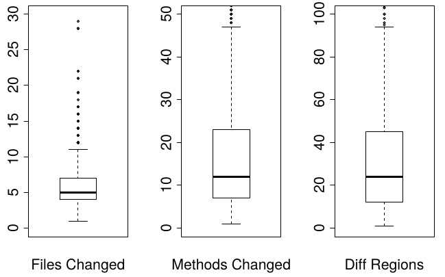

# Introduction

Considering the promising results of the recently devised ClusterChanges (CC) technique published by Barnett et al., we would like to better understand how widely applicable the technique is. To this end, we intend to analyze how ClusterChanges performs in a different context, namely open source software projects written by different organizations. 

In this initial study, we aimed to replicate the original quantitative study as closely as possible while using a an open source software context. Therefore, we applied the ClusterChanges technique to a sample of 1000 pull requests from the most popular Java OSS projects hosted at GitHub. 

We chose to use pull requests because we believe they closely mirror the changesets used in the original CC study. That is, both are sets of pairs of changed files (before-file and after-file) that were submitted to be reviewed by other developers. As for using the most popular OSS projects, we hypothesized that they would have large numbers of pull requests to analyze. We chose GitHub because, at the time of writing, it is the largest code hoster in the world with about 21.3M repositories and a large amount of those are OSS projects. Regarding Java, aside from being a popular language for OSS projects, it allows us to verify if ClusterChanges is applicable to other programming languages.

We have implemented the ClusterChanges technique for Java projects and refer to this implementation as *ccjava* in this document. As the Roslyn compiler only works with C# code, we used the Eclipse Compiler for Java (ECJ) for parsing Java code in order to identify def-use, use-use and same enclosing methods relationships between diff-regions. We chose ECJ because it's a mature, open and incremental compiler whose main goal is analyzing partial programs that may not be fully compilable. The Eclipse IDE uses ECJ for performing real-time static analysis while the developers are editing the source code.


# Goal

* Analyze the effectiveness of ClusterChanges in the context of open source projects;
* Compare these results with the original study results, which were obtained in a different context.

# Data collection

In this section, we describe how we obtained the data used in this analysis. The dataset used is available at: <https://github.com/victorclf/ccjava-analysis>

## Software project sample selection

We chose 10 software projects from GitHub in the following way:

1. In the GitHub web page, we asked for the list of open source Java projects in descending order of **stars** (search string: *stars:>1 language:java*). We hypothesized that the projects with the most stars are the most popular and would have the most pull requests.
2. Then we manually analyzed each software project in the list (until we had 10 projects) and selected it for the study if:
  + It used GitHub's pull request system;
  + It was not a mirror of a repository maintained somewhere else. When this is case, the GitHub's pull request system  is not being used by the project;
  + It had at least 300 pull requests which contained Java source code;
  + It was targeted at the JVM (i.e. Android exclusive projects were not considered);

## Pull request

A pull request consists of the created/modified files (after-files) and their corresponding diff files.

## Pull request sampling

For each software project:

1. Sampled 300 pull requests at random that matched the following criteria:
  + Had at least one Java source code after-file
2. Ran ccjava on these 300 pull requests;
3. Of these 300 pull requests, sampled 100 pull requests at random that matched the following criteria:
  + Was analyzed by ccjava without errors or warnings (see Limitations section at the end)

# Dataset description

The dataset is composed of the files below which were obtained after running ccjava on 1000 pull requests:

* allDefs.csv (Project name, Pull request ID, Definition ID, Source file, Character span, Name, Is type definition?, Is method definition?, Is inside a diff-region?)
* allUses.csv (Project name, Pull request ID, Use ID, Source file, Character span, Name, Associated definition)
* allDiffs.csv (Project name, Pull request ID, Diff-region ID, Source file, Line span, Character span)
* allDiffRelations.csv (Project name, Pull request ID, Relation ID, Relation type, Diff-region 1, Diff-region 2)
* allPartitions.csv (Project name, Pull request ID, Partition ID, Is partition trivial?, A diff region that is part of the partition, Method enclosing the diff-region)
* allSummary.csv (Project name, Pull request ID, Number of source files, Number of definitions, Number of uses, Number of diff-regions, Number of partitions, Number of non-trivial partitions, Number of trivial partitions)


# Analysis

```{r, echo=FALSE, message=FALSE}
library(dplyr)
library(ggplot2)
library(grid)
library(scales)
summ <- read.csv("data/allSummary.csv")
partitions <- read.csv("data/allPartitions.csv")
pullRequests <- select(summ, projectName, pullRequestId)

# Adds methodsChanged column to summ
enclosingMethods <- partitions %>%
  select(projectName, pullRequestId, enclosingMethodDefId) %>%
  distinct() %>%
  filter(enclosingMethodDefId != "null")
methodsChanged <- pullRequests %>%
  left_join(enclosingMethods, by=c("projectName", "pullRequestId")) %>%
  group_by(projectName, pullRequestId) %>%
  summarise(methodsChanged = sum(!is.na(enclosingMethodDefId)))
summ <- summ %>%
  inner_join(methodsChanged, by=c("projectName", "pullRequestId"))

# Adds diffsInNonTrivialPartitions and RDN column to summ
diffsInNonTrivialPartitions <- pullRequests %>%
  left_join(filter(partitions, isTrivial == "false"), by=c("projectName", "pullRequestId")) %>%
  group_by(projectName, pullRequestId) %>%
  summarise(diffsInNonTrivialPartitions = sum(!is.na(isTrivial)))
summ <- summ %>%
  inner_join(diffsInNonTrivialPartitions, by=c("projectName", "pullRequestId")) %>%
  mutate(rdn = diffsInNonTrivialPartitions / diffs)

trivialPartitions <- select(summ, trivialPartitions)

nonTrivialPartitions <- select(summ, nonTrivialPartitions)


```

## Pull Requests

```{r, echo=FALSE, warning=FALSE}
filesChanged <- select(summ, projectName, pullRequestId, filesChanged = sourceFiles)
#methodsChanged <- select(summ, projectName, pullRequestId, methodsChanged)
diffRegions <- select(summ, projectName, pullRequestId, diffRegions = diffs)
```

In this section, we analyze our dataset of pull requests using the three metrics below, which were calculated for each pull request: 

* files changed (number of files which were modified)
* methods changed (methods which are inside a diff-region for each pull request)
* diff-regions (contiguous sequence of lines that were added or modified; deleted lines are not considered)

### Files Changed

```{r, echo=FALSE, warning=FALSE}
ggplot(filesChanged, aes(x=filesChanged)) + geom_histogram(breaks=seq(0, 30, by=1), col="black", fill="lightblue") + xlab("Files Changed")
```

Quantiles

```{r, echo=FALSE, warning=FALSE, comment=""}
filesChangedQuantiles <- quantile(x=filesChanged$filesChanged, probs=seq(0.05, 1, 0.05))
print(filesChangedQuantiles)
filesChangedECDF <- ecdf(filesChanged$filesChanged)
```

The histogram of Java source code files that were edited in each pull request indicate that changes in pull requests tend to be focused on a very small amount of files. In this sample, `r percent(filesChangedECDF(2))` of the pull requests affected at most 2 files and `r percent(filesChangedECDF(4))` of the pull requests affected at most 4 files.

This result suggests that pull requests are small and consequently easy to understand. However, other studies including the original CC study found that, even if few files are changed, it is still hard to understand the changes if there are several diff-regions.

Although the 95% quantile is `r filesChangedQuantiles["95%"]`, the largest pull request modified `r filesChangedQuantiles["100%"]` files. Considering this, we manually analyzed the first 5 pull requests with most files changed (shown below) to see if anything interesting could be observed and if these pull requests are actually valid.

```{r, echo=FALSE, comment=""}
filesChangedDescOrder <- summ %>%
  select(pName = projectName, prId = pullRequestId, filesChanged = sourceFiles, NTPs = nonTrivialPartitions, TPs = trivialPartitions, RDN = rdn) %>%
  arrange(desc(filesChanged))
head(filesChangedDescOrder, n=5)

summElastic5708 <- filter(summ, projectName == "elastic/elasticsearch", pullRequestId == 5708)
```

The [1st pull request](https://github.com/elastic/elasticsearch/pull/5708) was accepted by the developers and is therefore a valid occurrence. However, we noted something quite interesting in the discussion  about it. The project developer reviewing the code expresses disappointment over the fact that the pull request actually consists of two separate tasks but has only one commit. After a brief discussion between the pull request author and this project developer, the latter agrees to merge the pull request as it is. Our implementation of ClusterChanges indeed generated 2 non-trivial partitions for this pull request and would likely have helped the project developer review this code. Of the `r select(summElastic5708, diffs)` diff-regions present in this pull request, `r select(summElastic5708, diffsInNonTrivialPartitions)` (`r select(summElastic5708, rdn)`) were grouped in these 2 non-trivial partitions.

The [2nd pull request](https://github.com/netty/netty/pull/370) was accepted by the developers but merged manually and consists of code style (formatting) modifications. Most of the diff-regions are additions of a copyright header and ClusterChanges does not identify such relationships. This explains why so many source files were changed and why non-trivial partitions were not found.

The [3rd pull request](https://github.com/netty/netty/pull/4) was rejected by the developers and there is not any discussion as to why that happened. After investigating the pull requesst message and the files changed, it seems reasonable to assume that this pull request was created incorrectly. The pull request message indicates that only the Javadoc of some methods were fixed, but 7,825 lines were added and most of the source code files were created. The presence of such invalid pull requests negatively impacts our assessment of the efficacy of ClusterChanges.

The [4th pull request](https://github.com/spring-projects/spring-framework/pull/554) was accepted by the developers and is valid. The author of the pull request created a compiler for a domain-specific language of the Spring Framework, thus a large number of files were created and modified. Apparently, this is a single task but 6 non-trivial partitions were identified nonetheless.

The [5th pull request](https://github.com/dropwizard/dropwizard/pull/996) is also valid and was accepted by the developers. The author replaced a widely used class in the project by another and as result there are a lot of diff-regions that are updates from references to the old class to references to the new class. For that reason, a lots of files were modified. Also, we believe it makes sense that only one non-trivial partition was detected here.

### Methods Changed

```{r, echo=FALSE, warning=FALSE}
ggplot(methodsChanged, aes(x=methodsChanged)) + geom_histogram(breaks=seq(0, 50, by=1), col="black", fill="lightblue") + xlab("Methods Changed")
```

Quantiles

```{r, echo=FALSE, warning=FALSE, comment=""}
methodsChangedQuantiles <- quantile(x=methodsChanged$methodsChanged, probs=seq(0.05, 1, 0.05))
print(methodsChangedQuantiles)
methodsChangedECDF <- ecdf(methodsChanged$methodsChanged)
```

The graph above show that the number of methods changed in a pull request tend to be small, but that it varies significantly and therefore pull requests that affect several methods are not unusual as evidenced by the very long positive tail. As much as `r percent(methodsChangedECDF(1))` of the pull requests only changed 1 method and the median of methods changed is `r methodsChangedQuantiles["50%"]`. In contrast, the second half of the distribution grows very quickly according to the quantiles. More specifically, we can see that 25% of the pull requests changed at least `r methodsChangedQuantiles["75%"]` methods and that 10% of the pull requests changed at least `r methodsChangedQuantiles["90%"]` methods.

We analyzed the 5 pull requests with the most methods changed to see what caused so many methods to be modified. These pull requests are listed below:

```{r, echo=FALSE, comment=""}
methodsChangedDescOrder <- summ %>%
  select(pName = projectName, prId = pullRequestId, methodsChanged, NTPs = nonTrivialPartitions, TPs = trivialPartitions, RDN = rdn) %>%
  arrange(desc(methodsChanged))
head(methodsChangedDescOrder, n=5)
```

The [pull request](https://github.com/netty/netty/pull/664) with 529 methods changed was valid and merged into the master branch. Most of the diff-regions consisted of changing the return value of several methods in a class hierarchy in order to support method chaining. Since the modified classes are meant to be used by users of the framework, there were few references to this modified methods and as a result there are a lot of partitions. Some of the modified methods were grouped into non-trivial partitions because test case methods referenced them (a def-use relationship).

The 2nd and 4th pull requests were previously described in the *Files Changed* section.

The [3rd pull request](https://github.com/libgdx/libgdx/pull/2889) mainly added classes which implement interfaces with a large number of methods. Unlike the 1st pull request with most methods changed, the partitioning of ClusterChanges worked well here because a lot of these methods reference the same class and consequently they were all grouped based on use-use relationships. 

The [5th pull request](https://github.com/facebook/presto/pull/308) mainly modified the exceptions returned by two classes with a large number of methods.

We conclude that the outliers shown here are valid occurrences and should not be discarded from our analysis.

### Diff-regions

```{r, echo=FALSE, warning=FALSE}
ggplot(diffRegions, aes(x=diffRegions)) + geom_histogram(breaks=seq(0, 100, by=1), col="black", fill="lightblue") + xlab("Diff-regions")
```

Quantiles

```{r, echo=FALSE, warning=FALSE, comment=""}
diffRegionsQuantiles <- quantile(x=diffRegions$diffRegions, probs=seq(0.05, 1, 0.05))
print(diffRegionsQuantiles)
diffRegionsECDF <- ecdf(diffRegions$diffRegions)
```

The distribution of diff-regions is strongly positively skewed. While `r percent(methodsChangedECDF(1))` of the pull requests have at most 1 diff-region and therefore are likely trivial to understand, as much as `r percent(1 - diffRegionsECDF(10))` pull requests have at least 10 diff-regions and 25% of the pull requests have at least `r diffRegionsQuantiles["75%"]` diff-regions. These large pull requests likely contain independent modifications and are hard to understand.

As in our previous discussions of other change size metrics, we now analyze the outliers for this distribution. At first glance, the existence of a pull request without any diff-regions seems to be an error, since a pull request represents a change and thus must have changed at least one line in the code. However, this is explained by the fact that ClusterChanges only looks at the after-files, i.e., deleted code is not considered. Hence, a pull request without any diff-regions is one where its authors only deleted lines.

Listed below are the 5 pull requests with most diff-regions in the dataset. Because we have already manually investigated these data points in our previous discussions of other change size metrics and for the sake of brevity, we do not manually analyze these outliers again here.

```{r, echo=FALSE, comment=""}
diffRegionsDescOrder <- summ %>%
  select(pName = projectName, prId = pullRequestId, diffs, NTPs = nonTrivialPartitions, TPs = trivialPartitions, RDN = rdn) %>%
  arrange(desc(diffs))
head(diffRegionsDescOrder, n=5)
```

### Boxplots of Change Sizes (This Study X Original Study)

```{r, echo=FALSE, warning=FALSE}
filesChangedBoxplot = ggplot(filesChanged, aes(x="", y=filesChanged)) +
  geom_boxplot() +
  coord_cartesian(ylim=c(0,30)) +
  scale_y_continuous(breaks=seq(0, 30, by=2)) +
  xlab("Files Changed") +
  ylab("")
methodsChangedBoxplot = ggplot(methodsChanged, aes(x="", y=methodsChanged)) +
  geom_boxplot() +
  coord_cartesian(ylim=c(0,40)) +
  scale_y_continuous(breaks=seq(0, 40, by=2)) +
  xlab("Methods Changed") +
  ylab("")
diffRegionsBoxplot = ggplot(diffRegions, aes(x="", y=diffRegions)) +
  geom_boxplot() +
  coord_cartesian(ylim=c(0, 100)) +
  scale_y_continuous(breaks=seq(0, 100, by=5)) +
  xlab("Diff-regions") +
  ylab("")
pushViewport(viewport(layout = grid.layout(1, 3)))
print(filesChangedBoxplot, vp = viewport(layout.pos.row = 1, layout.pos.col = 1))
print(methodsChangedBoxplot, vp = viewport(layout.pos.row = 1, layout.pos.col = 2))
print(diffRegionsBoxplot, vp = viewport(layout.pos.row = 1, layout.pos.col = 3))
```



TODO: compare with original study

***


## Partitions

### Histogram of trivial partitions

```{r, echo=FALSE}
ggplot(data=summ, aes(trivialPartitions)) + geom_histogram(breaks=seq(0, 20, by=1), col="black", fill="lightblue")
summary(summ$trivialPartitions)
```

TODO: replace summary by quantiles

### Histogram of non-trivial partitions

```{r, echo=FALSE}
ggplot(data=nonTrivialPartitions, aes(nonTrivialPartitions)) + geom_histogram(breaks=seq(0, 10, by=1), col="black", fill="lightblue")
summary(nonTrivialPartitions$nonTrivialPartitions)
```

TODO: replace summary by quantiles

TODO: Look for correlations between partitions and filesChanged,methodsChanged and diff-regions


***


## Ratio of diff-regions inside non-trivial partitions (RDN)

In this section, we analyzed the metric RDN, which is the ratio of diff-regions inside a non-trivial partition to the total number of diff-regions. We believe this metric provides a better idea of the efficacy of the algorithm instead of looking solely at the number of non-trivial and trivial partitions. For instance, consider the pull request below:

```{r, echo=FALSE, comment=""}
#head(arrange(select(summ, projectName, pullRequestId, diffs, nonTrivialPartitions, trivialPartitions, rdn), desc(diffs)), n=10)
summ %>% 
  select(pName = projectName, prId = pullRequestId, nonTrParts = nonTrivialPartitions, trParts = trivialPartitions, diffs, diffsInNonTrParts = diffsInNonTrivialPartitions, rdn) %>%
  filter(pName == "netty/netty", prId == 4)
```

The high number of trivial partitions suggests that ClusterChanges wasn't very effective for this pull request when, in fact, it managed to group 82.8% of the diff-regions into non-trivial partitions.

```{r, echo=FALSE}
ggplot(data=summ, aes(rdn)) + geom_histogram(binwidth=0.01, col="black", fill="lightblue") + 
  ggtitle("Ratio of diff-regions inside non-trivial partitions (RDN)") + 
  xlab("RDN (binwidth = 0.01)")
ggplot(data=filter(summ, !is.na(rdn), rdn > 0), aes(rdn)) + geom_histogram(binwidth=0.05, col="black", fill="lightblue") + 
  ggtitle("Ratio of diff-regions inside non-trivial partitions (RDN) where RDN > 0") + 
  xlab("RDN (binwidth = 0.05)")
summary(summ$rdn)
rdnQuantiles <- quantile(x=summ$rdn, probs=seq(0.05, 1, 0.05), na.rm=TRUE)
print(rdnQuantiles)
#plot(ecdf(summ$rdn))
```


# Main findings

TODO

# Limitations
As of this writing, some changesets aren't being fully analyzed by our tool. This seem to be caused by limitations in ECJ. For instance, we have observed that ECJ is not detecting the use of a field when this use is inside a lambda function. As this may result in missing relationships and seem to be implementation issues unrelated to ClusterChanges, we have excluded such changesets from the dataset for now.

# Future work

* Is there a relationship between the number of non-trivial/trivial partitions and whether the pull request was accepted?